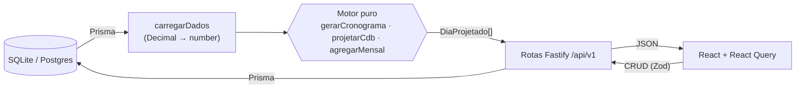

# Cronograma Financeiro

Planejamento financeiro **preditivo** (single-user, pt-BR, R$). Transforma a vida
financeira em uma linha do tempo diária que projeta o saldo bancário para os próximos
meses, para antecipar quando a conta fica negativa e agir antes.

> **Regra de ouro:** dinheiro incerto nunca entra na projeção real — só no simulador "E se?".

## Stack

- **Monorepo** npm workspaces: `packages/shared`, `apps/api`, `apps/web` (web chega na Fase 3).
- **Backend:** Node + Fastify, API REST `/api/v1`.
- **Banco:** Prisma + SQLite (dev) → Postgres (prod: troca só o `provider` + `DATABASE_URL`).
- **Motor de cálculo:** funções puras em `packages/shared/src/engine` (meta 100% de cobertura, Vitest).
- **Validação:** Zod (schemas compartilhados entre API e web).
- **Datas:** `date-fns`; datas de calendário como string `YYYY-MM-DD`; fuso `America/Sao_Paulo`.
- **Frontend (Fase 3+):** React + Vite + Tailwind + React Query + Recharts.

## Setup

```bash
npm install
npm run db:migrate           # cria o banco (SQLite) e aplica as migrations
npm run db:seed              # popula com os dados de exemplo (Seção 9 do briefing)
npm run dev                  # sobe a API em http://localhost:3333  (GET /health)
npm run dev -w @cf/web       # noutro terminal: sobe o app em http://localhost:5173
```

Outros scripts: `npm test` (motor, 100% de cobertura), `npm run typecheck`, `npm run db:studio`
(inspeciona o banco), `npm run db:reset`.

**E2E (Playwright):** `npm run e2e:install` (baixa o Chromium, 1ª vez) e depois `npm run e2e`.
Os testes rodam contra um banco isolado (`test.db`, data-base fixa) e sobem API+web sozinhos.

## Fluxo de dados do motor



Nenhuma resposta da API vem de valor pré-calculado no banco — tudo é derivado ao vivo do
motor a cada request (é aritmética barata sobre poucas centenas de linhas). Isso evita dado
dessincronizado.

## Decisões de design

- **Single-user:** `Config` é singleton (`id = "singleton"`), sem tabela de usuários. Como o
  motor recebe as entidades por parâmetro, adicionar `userId` depois é migração aditiva.
- **Datas como `String "YYYY-MM-DD"`:** datas de negócio não têm hora nem fuso; guardá-las
  como data pura elimina bugs de fuso. `createdAt/updatedAt` seguem `DateTime`. "Hoje" é
  calculado em `America/Sao_Paulo` (`hojeEmSaoPaulo`).
- **Dinheiro:** `Decimal` no banco; convertido para `number` (reais) na borda DB↔motor
  (`carregarDados`); todo resultado monetário passa por `arredondar()` (2 casas). Juros do
  CDB são arredondados por mês.
- **Regra do dia 31 em meses curtos:** o banco guarda o dia **cru** (ex.: 31). **O motor** faz
  `Math.min(dia, getDaysInMonth(mês))` a cada mês (`diaEfetivoNoMes`), então fevereiro
  bissexto (29) e não bissexto (28) se resolvem sozinhos. Vale para receitas **e** saídas fixas.
- **Enums como `String` + Zod:** SQLite não tem enum nativo no Prisma; a validação real
  (`"entrada"|"saida"`, `"aporte"|"resgate"`) vive no Zod compartilhado. Vira enum nativo no
  Postgres sem tocar em regra de negócio.
- **`gastoVariavel` (ponto crítico da Seção 4.1):** usa o total real de `LancamentoDiario` do
  dia se existir; senão cai para o orçamento diário como **previsão**. Cada `DiaProjetado`
  carrega a flag `gastoVariavelEhPrevisao` para a UI distinguir real de previsto.

## Roadmap (fases)

- [x] **Fase 0** — Monorepo, schema Prisma, migrations, seed.
- [x] **Fase 1** — Motor de cálculo puro + suíte Vitest (100% de cobertura).
- [x] **Fase 2** — API REST sobre o motor.
- [x] **Fase 3** — CRUD UI (`apps/web`).
- [x] **Fase 4** — Telas de visualização (Totais, Saldos, Cronograma, Investimentos, Simulador).
- [x] **Fase 5** — Polish (error boundary, code-split dos gráficos) + E2E (Playwright).
